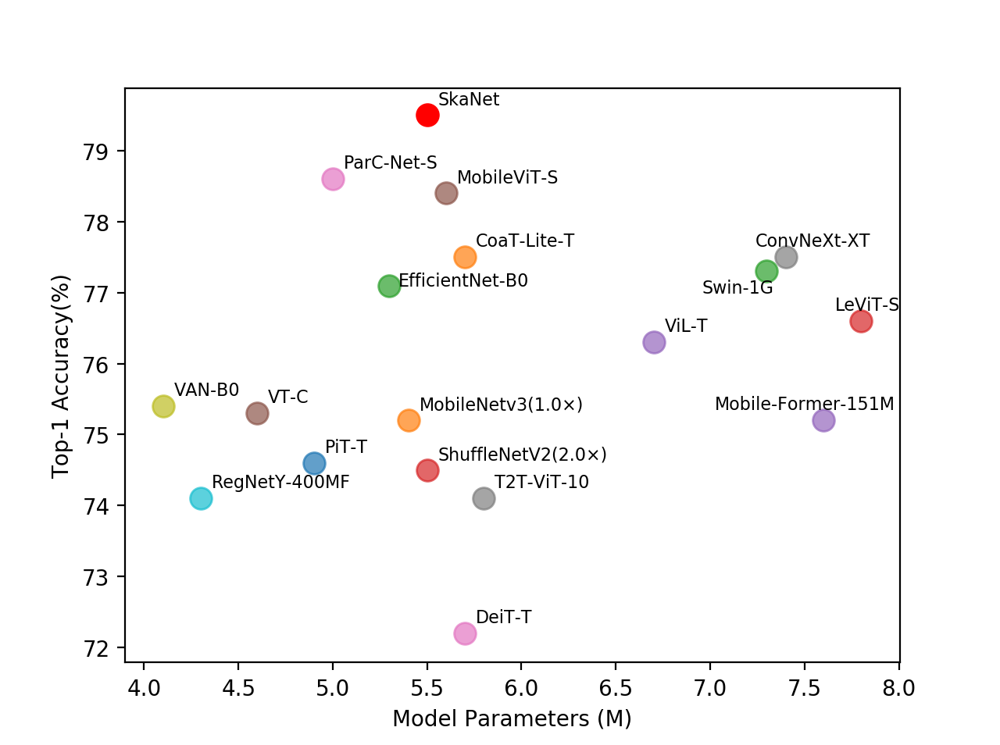

# SkaNet: Split Kernel Attention Network 

This is a PyTorch implementation of **SkaNet** proposed by our paper **"SkaNet: Split Kernel Attention Network"**.



Figure : **Compare with different vision backbones on ImageNet-1K validation set.** 

### Abstract:

Recently, convolutional neural networks (CNNs) and vision transformers (ViTs) have shown impressive results in the area of lightweight models for edge devices. However, the dominant CNNs and ViTs architectures rely heavily on a structured grid or sequence representation of images, which can result in inflexible handling of complex or irregular objects within them. In this paper, we propose SkaNet, an innovative, high-performance hybrid architecture that synergistically integrates the benefits of both CNNs and ViTs, and further enhances these advantages by graph representation learning. Specifically in SkaNet, we introduce a novel linear attention named split kernel attention (SKA) that exploits graph convolution to capture global semantic information and facilitate flexible recognition of irregular objects, splits input tensors into multiple channel groups adaptively, and fuses aforementioned modules into linear attention to efficiently aggregate contextual information. Extensive experiments demonstrate that SkaNet outperforms popular light-weight CNN and ViT-based models on common vision tasks and datasets. For classification on ImageNet-1k, SkaNet-S, with 5.5M parameters, achieves an impressive top-1 accuracy of 79.5%, surpassing MobileViT-S with an absolute gain of 1.1%. Furthermore, SkaNet-S exhibits superior performance in semantic segmentation on PASCAL VOC 2012 and object detection on COCO 2017. Our source code is available on GitHub at: https://github.com/charryglomc/skanet.


## Image Classification

Data prepare: ImageNet with the following folder structure.

```
│imagenet/
├──train/
│  ├── n01440764
│  │   ├── n01440764_10026.JPEG
│  │   ├── n01440764_10027.JPEG
│  │   ├── ......
│  ├── ......
├──val/
│  ├── n01440764
│  │   ├── ILSVRC2012_val_00000293.JPEG
│  │   ├── ILSVRC2012_val_00002138.JPEG
│  │   ├── ......
│  ├── ......
```


### 2. VAN Models (IN-1K)

| Model     | #Params(M) | GFLOPs | Top1 Acc(%) |
| :-------- | :--------: | :----: | :---------: |
| SkaNet-S |    5.5    |  2.36  |    79.5    |


### 3.Requirement

```
1. Pytorch >= 1.7
2. timm == 0.4.12
```

### 4. Train 

We use 8 GPUs for training by default.  Run command (It has been writen in train.sh): sh train.sh

```bash
MODEL=skanet_small 
CUDA_VISIBLE_DEVICES=0,1,2,3,4,5,6,7 nohup bash distributed_train.sh 8 your_imagenet_path   --model $MODEL -b 128 -vb 128 --input-size  3 256 256 \
	  --amp --train-interpolation "bicubic" \
	  --epochs  300  --lr 1e-3 \ 
	  --crop-pct  0.9 --model-ema \
	  > nohup_skanet_small.out  2>&1   &
	 

```

### 5. Validate

Run command (It has been writen in eval.sh) as: sh eval.sh


```bash
MODEL=skanet_small 
python3 validate.py your_imagenet_path --model $MODEL \
  --checkpoint your_pretained_model_path -b 128 \
  --amp --num-classes 1000  --input-size 3 256 256 \
  > nohup_skanet_small_eval.out  2>&1   &

```

## 6.Acknowledgment

Our implementation is mainly based on [pytorch-image-models](https://github.com/rwightman/pytorch-image-models), [PoolFormer](https://github.com/sail-sg/poolformer) and [VAN](https://github.com/Visual-Attention-Network/VAN-Classification). Thanks for their authors. 


## LICENSE

This repo is under the Apache-2.0 license. For commercial use, please contact the authors.
